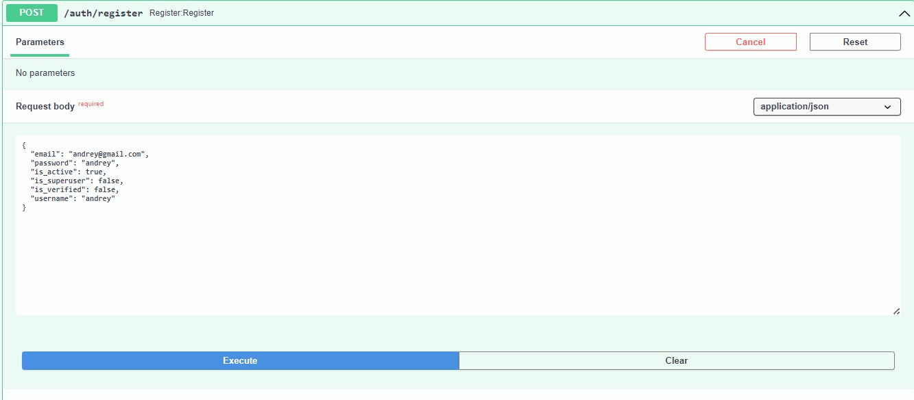

# fastAPI-with-AI
This FastAPI application provides APIs for user management, post creation, and comment management, including analytics on comments for a given date range. Additionally, the application uses AI to block comments containing profanity. These comments are still stored in the database for analysis purposes.


## Features
- User registration and authentication
- CRUD operations for posts and comments
- AI-powered profanity detection to block inappropriate posts and comments
- Analytics on comment creation over a specified date range
- Profanity filtering for posts and comments during creation
- Aggregated daily analytics on comments, including created and blocked comments


## Requirements

- Python 3.7+
- FastAPI
- SQLAlchemy
- PostgreSQL
- Requests


## Installation

### **Clone the Repository**

```
git clone https://github.com/Yevheniia-Ilchenko/fastAPI-with-AI.git

```
### Create a .env File
Create a .env file in the root directory of the project and add the following content:
```
OPENAI_API_KEY=your-openai-api-key


```
### Install Dependencies

```
pip install -r requirements.txt
```
### Running

Run the FastAPI application:
```
uvicorn main:app --reload
```
## API Endpoints

 

## User Management
 - POST /auth/register: Register a new user



 - POST /auth/login: Login a user


## Posts
 - POST /posts/: Create a new post
 - GET /posts/{post_id}: Get a post by ID
 - PUT /posts/{post_id}: Update a post by ID
 - DELETE /posts/{post_id}: Delete a post by ID
## Comments
 - POST /comments/: Create a new comment

if the comment containing profanity - it is blocked


 - GET /comments/{comment_id}: Get a comment by ID
 - PUT /comments/{comment_id}: Update a comment by ID
 - DELETE /comments/{comment_id}: Delete a comment by ID
## Analytics
 - GET /api/comments-daily-breakdown?date_from=YYYY-MM-DD&date_to=YYYY-MM-DD: Get daily breakdown of comments created and blocked within a specified date range
 - 

 - 
## Profanity Filtering
The application uses an AI-powered profanity detection system to block posts and comments that contain inappropriate language. While these posts and comments are blocked from being published, they are still stored in the database for analysis purposes.


